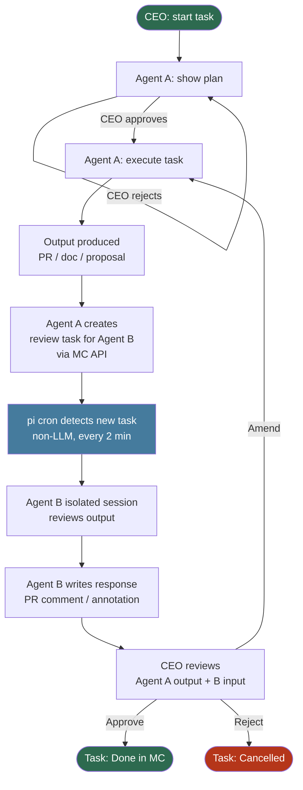

> **Question:** Document the operational flow of the virtual company — triggers, outputs, cross-agent involvement, automation. Compare the standup-driven model with a simpler CEO-driven model. Reframe heartbeats and standup. Include a diagram. Clarify the different output types and the cross-agent task mechanism including cycle prevention.
>
> _v2 — updated 2026-03-20: output types expanded, cross-agent mechanism detailed, infinite cycle prevention documented._

---

## The short version

The standup-driven model (Model A) puts the clock in charge. The CEO is reactive. Every morning five agents wake up and spend tokens whether or not the CEO is available or has anything to decide. The standup chain has complex timing dependencies and a single point of failure.

The CEO-driven model (Model B) puts you in charge. Nothing moves without you. Agents are reactive, not proactive. Cost is proportional to actual work. Complexity disappears because there is no coordination problem to solve — only you can initiate a cycle.

**Model B is the right model for this stage.** The recommendation is to adopt it now and treat Model A (standup) as an optional visibility tool you can trigger manually.

---

## Model B — CEO-driven operational flow

### Core principle

Every work cycle begins with a human decision and ends with a human decision. Agents act only in response to an approved trigger. The system is a decision amplifier, not an autonomous engine.

### The work cycle

```
┌─────────────────────────────────────────────────────────────────────────────┐
│                                                                             │
│  CEO opens MC chat with Agent A                                             │
│  "Start task: [description]"                                                │
│         │                                                                   │
│         ▼                                                                   │
│  Agent A shows plan (plan mode = always on)                                 │
│         │                                                                   │
│         ├── CEO rejects → revised plan → loop                              │
│         │                                                                   │
│         └── CEO approves                                                    │
│                   │                                                         │
│                   ▼                                                         │
│          Agent A executes                                                   │
│          Produces: PR / design doc / proposal / report                      │
│                   │                                                         │
│                   └── At least once per task:                               │
│                       Agent A creates a review task for Agent B             │
│                       (via MC API during its session)                       │
│                               │                                             │
│                               ▼                                             │
│                    ◀── AUTO-TRIGGER (pi cron, no LLM) ──▶                  │
│                        Detects new task on Agent B's board                  │
│                        Wakes Agent B in isolated session                    │
│                               │                                             │
│                               ▼                                             │
│                    Agent B reviews Agent A's output                         │
│                    Produces: PR comment / annotation / flag                 │
│                    Marks review task done                                   │
│                               │                                             │
│                               ▼                                             │
│                    Agent A's context updated with B's response              │
│                    (written to shared file or PR comment)                   │
│                               │                                             │
│                               ▼                                             │
│          CEO reviews Agent A's complete output                              │
│          (including B's input)                                              │
│                   │                                                         │
│                   ├── Approve → task → Done in MC                          │
│                   ├── Amend   → Agent A revises → new review if needed     │
│                   └── Reject  → task → Cancelled with reason               │
│                                                                             │
└─────────────────────────────────────────────────────────────────────────────┘
```

---

### Mermaid diagram



---

### Output types

Four distinct output types are produced in this system. They differ in scope, permanence, and what the CEO must do with them.

---

#### PR — Pull Request

**What it is:** A proposed change to a Git repository, submitted as a branch diff waiting for merge.

**When it is produced:**
- Whenever an agent changes code, configuration, or documentation that lives in a repo
- Always on a feature branch, never directly on `main`

**Who produces it:** Developer agents only — Axle (Engine), Pixel (Console), Beacon (Site). QM and PM may open PRs on the `idea` repo for proposals or design docs, but never touch code repos.

**Where it lands:** GitHub PR on the relevant repo (`agent-engine-dev`, `agent-console-dev`, `agent-site-dev`, `idea`)

**What the CEO does:** Reviews the diff on GitHub → merges (approves) or requests changes (amends) via chat. No agent merges to `main`.

**Cross-agent involvement:** Veri (QM) is the natural reviewer for all code PRs — she checks quality, consistency, and test coverage. Axle creating a PR → auto-triggers a Veri review task.

---

#### Design doc

**What it is:** A structured document that defines the *approach* to a problem before implementation begins. It is a decision record, not a deliverable.

**When it is produced:**
- Before implementing any feature with significant architectural choices or unknowns
- When QM flags concerns during a PR review that require a design decision first
- When the CEO asks an agent to think through an approach before coding

**Who produces it:** Developer agents (primarily Axle) at the CEO's request, or proposed by any agent when they recognise a decision needs to be made before work can proceed.

**Where it lands:** Written as a markdown file, committed via PR to the `idea` repo under `design/`. Once merged, it becomes the reference document for implementation.

**What the CEO does:** Reads and approves by merging the PR. A design doc PR is lightweight — no code, just thinking. CEO can request changes before implementation begins.

**Cross-agent involvement:** QM reviews all design docs before the CEO sees them (auto-triggered). This is the right time to catch architectural problems — cheaper than finding them during implementation.

---

#### Proposal

**What it is:** A structured argument for adding a new item to the backlog. It is the entry point for all new work.

**When it is produced:**
- When any agent identifies a new need, gap, or opportunity not already in the backlog
- When the CEO has an idea and wants it shaped before it becomes a task
- When a field partner or grant requirement surfaces a product need (Marco's domain)

**Who produces it:** Any agent. Marco (Programme Manager) most often — field reports frequently surface product needs. Axle raises technical proposals (refactors, infrastructure). QM raises cross-cutting concerns (privacy, consistency).

**Where it lands:** Written as `proposals/YYYY-MM-DD-<topic>.md`, committed via PR to the `idea` repo. The PR is the collaboration surface — other agents add their perspective as PR comments before the CEO sees it.

**What the CEO does:** Reviews the enriched proposal (with cross-agent comments) → merges (creates a task in MC from it) or closes with a reason.

**Cross-agent involvement:** Proposals explicitly tag the agents whose input is needed. This is the one case where multiple agents review in parallel rather than sequentially — each contributes a comment to the PR. This is also a case where the CEO *manually* decides who to ask, not the auto-trigger mechanism.

---

#### Report

**What it is:** A structured narrative document — not a code change, not a decision record. It summarises state, activity, or findings for human consumption.

**When it is produced:**
- Field partner updates and school visit summaries (Marco)
- Grant application progress and deadline tracking (Marco)
- Quality reports — test coverage, open issues, drift from design docs (Veri)
- Standup contributions (all agents, when standup is triggered)

**Who produces it:** Marco (Programme Manager) and Veri (QM) primarily. Reports are Marco's main output type. Developer agents rarely produce reports — their status is visible in PRs and MC tasks.

**Where it lands:** Written directly to the agent's workspace or to `standups/`, committed to the `idea` repo. Reports do not go through a PR (they are not proposals or code). They are committed directly to `main` (or to the agent's own repo).

**What the CEO does:** Reads and decides whether to act. A report may prompt the CEO to start a new work cycle (e.g. "Marco's field report mentions X — let's add that to the backlog"), but the report itself is not a work output that requires approval.

**Cross-agent involvement:** Reports are usually self-contained. Exception: if Marco's grant report reveals a technical dependency, she creates a review task for Axle to assess feasibility before the report is finalised.

---

### Triggers and outputs — complete reference

| Trigger | Who starts it | Agent(s) involved | Output type |
|---------|--------------|-------------------|-------------|
| CEO message to agent | CEO | 1 primary + auto reviewer | PR / design doc / proposal / report |
| CEO approves plan | CEO | Primary agent | Execution begins |
| CEO amends output | CEO | Primary agent (revises) | Updated version of same output type |
| CEO rejects output | CEO | Primary agent | Task cancelled, MC updated |
| Agent creates `auto-review` task | Primary agent | Reviewer agent (auto-triggered) | PR comment / annotation / flag |
| **[auto-trigger]** new `auto-review` task detected | pi cron | Reviewer agent only | Response appended to original output |
| CEO merges PR | CEO | None (git event) | Main branch updated, task → Done |

---

### The cross-agent task mechanism

#### How Agent A creates a task for Agent B

During its session, Agent A calls the MC API:

```
POST /api/v1/agent/boards/{agent_b_board_id}/tasks
{
  "title": "Review: [Axle's PR #14 — standup template implementation]",
  "description": "Axle has completed task c74d6a8d (Scan Solution Description).\n\nPlease review:\n- PR: https://github.com/koenswings/agent-engine-dev/pull/14\n- Check: test coverage, consistency with PROCESS.md, no regressions\n\nRespond by adding a review comment on the PR (approve / request changes).\nMark this task done when complete.\n\n⚠ This is a depth-1 auto-review task. Do not create further tasks.",
  "status": "inbox",
  "tags": ["auto-review"]
}
```

Key properties of a review task:
- Created on **Agent B's board**, not Agent A's board
- Tagged `auto-review` — this is the signal to the pi cron
- Title prefixed with "Review:" — distinguishes it visually in MC
- Description is fully self-contained: Agent B should need no further context to act
- Description explicitly flags it as depth-1 (no further tasks)

#### The pi cron (`check-new-tasks.sh`)

```
pi cron, every 2 minutes, no LLM:

1. For each agent board:
   a. Fetch tasks tagged "auto-review" with status "inbox"
   b. For each such task:
      - Check triggered-tasks.log: has this task ID been triggered before?
      - If YES → skip (prevents double-trigger on retries)
      - If NO:
        i.  Mark task status → "in_progress" via MC API
            (prevents a second cron run from triggering the same task)
        ii. Append task ID to triggered-tasks.log
        iii. Fire isolated gateway session for Agent B:
             prompt = task title + description
             sessionTarget = "isolated"
             delivery = { mode: "announce", channel: "last" }
```

The `triggered-tasks.log` is a simple flat file at `/home/pi/idea/logs/triggered-tasks.log`. One task ID per line. Never deleted — it is the definitive record of what has been auto-triggered.

#### Why there are no infinite cycles

**Three independent guards, each sufficient on its own:**

**Guard 1 — Instruction (primary)**
Agent B's SOUL.md and AGENTS.md include a hard rule: _"If your current session was triggered by an `auto-review` task, your only actions are: read the tagged artifact, write a response to it, mark the task done, exit. Do not create tasks of any kind during this session."_

Agent B knows this because it reads SOUL.md at the start of every session. Auto-triggered isolated sessions include the task description, which also contains the ⚠ depth-1 warning.

**Guard 2 — Tag propagation (mechanical)**
The pi cron only auto-triggers tasks tagged `auto-review`. If Agent B were to create a task during an auto-triggered session (violating Guard 1), that task would only be auto-triggered if Agent B also tagged it `auto-review`. Since the instruction explicitly prohibits creating tasks at all, tagging one `auto-review` would require two violations simultaneously.

**Guard 3 — Triggered log (mechanical)**
Even if Guards 1 and 2 both failed and a depth-2 `auto-review` task somehow appeared, `triggered-tasks.log` ensures each task ID is only triggered once. A depth-2 task would be triggered once, Agent C would respond, and the chain would stop — no further tasks would be created by a depth-2 session.

**In practice:** Guard 1 is the operative rule. Guards 2 and 3 are safety nets that cost nothing to maintain.

#### The depth boundary — why one auto-triggered round is enough

One round of auto-triggered review is sufficient because:
- The review task is scoped to a specific, bounded question (does this PR meet quality standards? is this design technically feasible?)
- Agent B's response is advisory — it does not change the primary output, it annotates it
- The CEO is the decision-maker for anything beyond a binary quality check
- If Agent B's review raises a concern requiring further work, that becomes part of the CEO's decision ("approve with Veri's caveats" or "send back to Axle") — not an autonomous chain

The rule is: **agents can initiate cross-agent involvement once per task iteration. The reviewer responds and stops. The CEO decides what happens next.**

---

## Model A vs Model B — comparison

| | Model A (standup-driven) | Model B (CEO-driven) |
|---|---|---|
| **Primary trigger** | System clock (07:30 cron) | CEO message |
| **Agent activity** | Every morning, regardless | Only when triggered |
| **CEO role** | Reactive (reads standup, then decides) | Active (initiates and gates every cycle) |
| **Cost when idle** | Daily standup tokens even if CEO unavailable | Zero |
| **Complexity** | High: 6 cron jobs, timing chain, skip logic | Low: 1 cron for review task detection |
| **Failure modes** | Standup runs while CEO is away for a week | Nothing happens until CEO returns |
| **Agent visibility** | All agents active every day | Only agents with active tasks |
| **Cross-agent input** | Via standup contributions (sequential) | Via review tasks (auto-triggered) |

---

## Heartbeat — redefined

Heartbeats are **not** a periodic "check in and report" mechanism. They are a **polling probe for external events** that the agent cannot be told about directly.

**Use a heartbeat only when:**
- There is an external system that the agent should react to
- That system cannot push a notification (no webhook available)
- The event is time-sensitive enough to warrant proactive detection

**Current valid heartbeat candidates:**

| External event | Agent | Poll mechanism |
|----------------|-------|----------------|
| CI test failure on `main` | Axle (Engine Dev) | Check GitHub Actions status |
| New grant deadline approaching | Marco (Programme Mgr) | Read `grant-tracker.md` dates |
| Open PR stale > 5 days | Veri (Quality Mgr) | Check GitHub open PRs |

**What heartbeats are NOT for:**
- Checking if there is work to do (that's the CEO's trigger)
- Generating standup content (that's an optional standup mechanism)
- Reporting status (that's what the CEO asks for directly)

**Heartbeat output:** when a heartbeat detects an alert condition, it writes a brief message to Telegram (CEO's Axle group, or a dedicated alerts group). It does NOT produce a full standup section or start any work — it raises a flag for the CEO to decide whether to act.

---

## Standup — redefined

Standup is an **optional visibility mechanism**, not a work trigger.

**CEO-triggered standup:**
```
CEO: /standup   (sends this message in Telegram)
    │
    ▼
Standup script runs on demand (same logic as cron version)
All agents contribute their current status
CEO reviews and decides whether to adjust any agent's direction
```

**What standup is for:**
- Cross-agent visibility when the CEO wants a broad picture
- Surfacing work that has drifted without producing explicit CEO-visible output
- Occasional cadence check (weekly, not daily)

**What standup is NOT for:**
- Starting new tasks (that is the CEO → agent direct trigger)
- Approving work (that happens in the work cycle)
- Replacing the work cycle (standup output does not create MC tasks directly)

**When to run:**
- At the CEO's discretion — weekly or when something feels off
- Before a planning session (to see current state before deciding what to start next)
- NOT on a fixed daily schedule

---

## Putting it together — the full system

```
        ┌─────────────────────────────────────────────────────┐
        │  CEO                                                 │
        │                                                      │
        │  • Starts work cycles (direct agent message)         │
        │  • Approves / amends / rejects output               │
        │  • Optional: /standup for broad visibility           │
        │  • Monitors: Telegram alerts from heartbeats         │
        └─────────┬──────────────────────────────┬────────────┘
                  │ work cycles                  │ visibility
                  ▼                              ▼
        ┌─────────────────┐           ┌──────────────────────┐
        │  Primary agent  │           │  Standup (optional)  │
        │  (Axle / Pixel  │           │  CEO-triggered only  │
        │  / Beacon etc.) │           │  All agents respond  │
        └────────┬────────┘           └──────────────────────┘
                 │ review task
                 ▼
        ┌──────────────────┐
        │  pi cron         │  ← lightweight, no LLM, always running
        │  (every 2 min)   │
        └────────┬─────────┘
                 │ auto-trigger
                 ▼
        ┌──────────────────┐
        │  Reviewer agent  │
        │  (usually Veri)  │
        └──────────────────┘
                 │
                 │ heartbeat alerts (external events only)
                 ▼
        ┌──────────────────┐
        │  Telegram        │
        │  CEO notification│
        └──────────────────┘
```

---

## What to build — ordered by value

| # | What | Why first |
|---|------|-----------|
| 1 | **`check-new-tasks.sh`** — the 2-min cron that auto-triggers reviewer agents | Enables the core cross-agent automation in Model B |
| 2 | **Telegram group bindings** (waiting for group IDs) | Enables CEO → agent direct messaging per agent |
| 3 | **`/standup` command** — CEO sends this in Telegram, triggers standup on demand | Replaces the broken daily standup cron with something useful |
| 4 | **`heartbeat-ci.sh`** — Axle polls GitHub Actions, fires alert to Telegram if `main` fails | First real external event heartbeat |
| 5 | **`heartbeat-grants.sh`** — Marco polls `grant-tracker.md` for approaching deadlines | Second real external event heartbeat |

Items 1 and 3 can be built immediately. Items 2, 4, 5 need Telegram group IDs or grant-tracker.md to exist first.

---

## What does NOT need to be built

- Daily standup cron chain (complex, expensive, fragile — replaced by on-demand `/standup`)
- Per-agent periodic heartbeats at fixed intervals (replaced by narrowly-scoped external event monitors)
- `export-backlog.sh` as a cron job (export on demand, or on MC task update)
